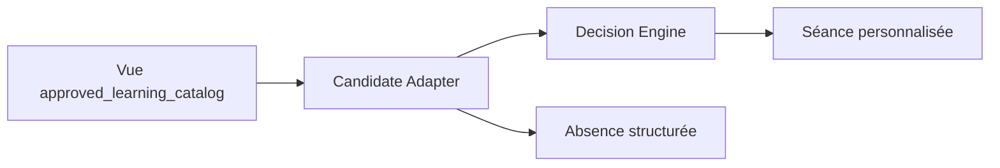

# Catalogue de contenus Approved

Le catalogue est reconstruit depuis [lcai_0009_catalog.json](../resources/catalog/lcai_0009_catalog.json) après les migrations V2. Sa source éditoriale est [build_demo_catalog.py](../scripts/build_demo_catalog.py) : les enregistrements sont explicites, déterministes, originaux et identifiés comme contenus internes.

Le lot contient 68 contenus :

- 32 en mathématiques, 24 en français ;
- 2 dans chacune des matières histoire, géographie, physique-chimie, SVT, anglais et espagnol ;
- 40 activités évaluatives ;
- 34 exemples travaillés corrigés ;
- 36 contenus marqués brevet ;
- 12 contenus de remédiation ;
- 28 contenus de transition.

Ces chiffres décrivent un lot ciblé de démonstration et non un programme complet.



La vue `approved_learning_catalog` exige simultanément une version `approved`, une approbation active, un exercice actif et non archivé, un rattachement curriculaire et une compétence primaire. Draft, Review et Archived restent invisibles.

## Reconstruction

```powershell
python -m migrations
python scripts/build_demo_catalog.py
python scripts/import_catalog.py --source resources/catalog/lcai_0009_catalog.json
```

Ajouter `--dry-run` pour valider sans écrire. Un second import identique ne crée aucune ligne.

