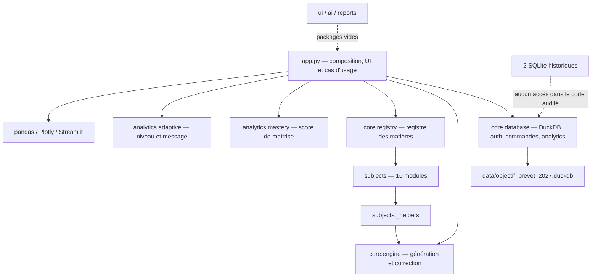
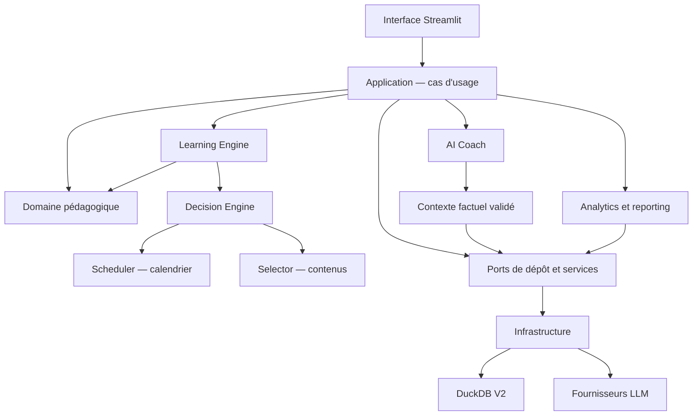

# LCAI-0001 — Architecture Blueprint

Statut : **Architecture Reference v1.0**, aucune migration exécutée
Périmètre audité : état du dépôt au 22 juillet 2026

## Résumé exécutif

Learning Coach AI est une application Streamlit fonctionnelle et compacte. Son exécution part de `app.py`, qui orchestre l'authentification, la navigation, les entraînements, les devoirs et les tableaux de bord. Les données utilisées par l'application sont dans `data/objectif_brevet_2027.duckdb`; deux bases SQLite historiques restent à la racine. Le contenu pédagogique est réparti dans dix modules de matières.

Le principal risque n'est pas la complexité algorithmique, mais la concentration des responsabilités : `app.py` contient toute l'interface et coordonne directement la persistance et le moteur; `core/database.py` mélange initialisation, migrations, authentification, commandes et requêtes analytics. Les packages `ui`, `ai` et `reports` sont des emplacements vides. Le moteur adaptatif actuel produit des scores et messages utiles, mais ne conserve ni état de maîtrise par compétence, ni planification espacée, ni trace de décision.

La cible officielle est un monolithe modulaire, pas un ensemble de microservices. Elle ajoute des frontières explicites entre UI, cas d'usage, domaine, moteur pédagogique, IA et persistance, tout en conservant Streamlit et DuckDB. Tous les futurs tickets doivent préserver les contrats de cette référence ou documenter une Architecture Decision Record qui les modifie.

## Carte d'architecture actuelle

Le cycle principal est : démarrage Streamlit → `init_db()` → initialisation de session → connexion/création de compte → navigation élève ou parent. Un entraînement génère des questions depuis une matière, corrige avec `is_correct()`, puis écrit chaque tentative. Un devoir crée un en-tête et ses questions, sauvegarde les réponses, calcule une note, puis alimente les vues analytiques.

## Architecture cible

Principes directeurs :

- dépendances dirigées vers le domaine; Streamlit et DuckDB restent aux bords;
- cas d'usage courts, transactionnels et testables sans UI;
- identifiants stables pour matières, compétences, exercices et tentatives;
- événements/tentatives immuables et projections recalculables;
- recommandations déterministes et explicables avant toute verbalisation par LLM;
- hiérarchie pédagogique canonique `Program → Subject → Domain → Skill → SubSkill`;
- séparation `Exercise` (unité pédagogique) / `Question` (item évaluable);
- profil cognitif distinct de `Mastery`, avec indicateurs probabilistes et niveau de confiance;
- `Decision Engine` seul responsable de l'arbitrage global; `Scheduler` et `Selector` restent spécialisés;
- migrations versionnées et exécutées explicitement, avec sauvegarde et validation;
- évolution incrémentale par extraction de code, sans réécriture totale.

## Décisions proposées

| Décision | Choix | Justification |
|---|---|---|
| Style | Monolithe modulaire | Taille actuelle et déploiement local ne justifient pas des services distribués. |
| UI | Streamlit conservé | Le besoin porte sur les frontières, pas sur un changement de framework. |
| Base | DuckDB V2, fichier unique par environnement | Cohérent avec l'existant analytique; accès mono-processus à cadrer. |
| Domaine | Python sans dépendance de framework | Tests rapides et règles réutilisables. |
| Persistance | Repositories + unité de travail légère | Évite le SQL dans l'UI et permet les tests d'intégration. |
| Historique | Tentatives et décisions append-only | Auditabilité et recalcul des projections de maîtrise. |
| IA | Adaptateur optionnel après moteur déterministe | Le LLM explique et accompagne; il ne décide pas seul. |
| Mémoire IA | Projection pédagogique reconstruite | Aucun état permanent n'est confié au LLM. |
| Profil apprenant | `Mastery` + profil cognitif séparé | Distingue connaissances et manière d'apprendre. |
| Configuration | Variables d'environnement + fichier non secret typé | Séparation claire du code, des paramètres et des secrets. |

## Qualités attendues et limites

- Testabilité : le domaine et le moteur doivent fonctionner avec des objets en mémoire.
- Traçabilité : toute recommandation possède une version de règle, des facteurs et des alternatives.
- Confidentialité : le contexte LLM est minimal, pseudonymisé si possible et sans PIN/hash.
- Robustesse : contraintes en base, transactions et erreurs spécifiques remplacent les `except Exception` génériques.
- Performance : les index proposés servent d'abord les parcours par apprenant, date, compétence et activité.
- Limite DuckDB : approprié à une application locale ou faiblement concurrente; réévaluer PostgreSQL avant un déploiement multi-utilisateur avec écritures concurrentes.

## Documents détaillés

- [Audit de l'existant](current-state-audit.md)
- [Structure cible](target-project-structure.md)
- [Modèle DuckDB V2](duckdb-v2-design.md)
- [Domain Model](architecture-domain-model.md)
- [Learner Cognitive Profile](learner-cognitive-profile.md)
- [Learning Engine](learning-engine-design.md)
- [Decision Engine](decision-engine.md)
- [AI Coach](ai-coach-design.md)
- [Conversation Memory](conversation-memory.md)
- [Roadmap Release 1.0](release-1-roadmap.md)

## Points à valider avant implémentation

1. Les deux SQLite racines sont-elles des sources à migrer, des sauvegardes, ou des prototypes abandonnés ? Le code actuel ne les référence pas.
2. DuckDB restera-t-il mono-utilisateur/local, ou une utilisation concurrente et distante est-elle prévue ?
3. Le référentiel de compétences doit-il reproduire un référentiel officiel précis et versionné ?
4. Quelles données sont autorisées à sortir vers un fournisseur LLM, notamment pour des mineurs ?
5. La création automatique du compte `Parent / 1234` doit être supprimée ou transformée lors du chantier sécurité.
