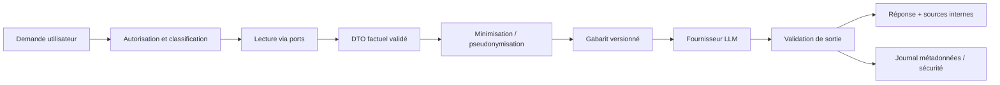

# AI Coach — conception

## Positionnement

L'AI Coach explique, encourage, questionne et reformule. Il ne calcule pas les notes, ne modifie pas la maîtrise, ne sélectionne pas seul la prochaine activité et ne crée pas de faits absents de la base. Le `Decision Engine` reste l'autorité du choix pédagogique; le Coach transforme ses décisions et des faits validés en interaction adaptée.

## Responsabilités

- expliquer une erreur à partir de la correction et du référentiel approuvés;
- reformuler une recommandation déterministe selon l'âge et le ton choisi;
- proposer des indices graduels sans révéler immédiatement la réponse;
- synthétiser progrès, échéances et objectifs;
- guider vers une fiche ou activité déjà sélectionnée;
- signaler l'incertitude et demander une précision lorsque les faits manquent.

Hors périmètre : diagnostic médical/psychologique, sanction, évaluation officielle, modification silencieuse des données, accès libre à toute la base ou génération autonome du programme.

## Accès aux données

Le Coach accède uniquement à un DTO construit par l'application : prénom ou pseudonyme si nécessaire, niveau scolaire, langue/ton, question courante, réponse donnée, correction approuvée, compétences associées, maîtrise et récence agrégées, objectif pertinent, décision explicable et [Conversation Memory](conversation-memory.md) minimale. Il ne reçoit jamais credential/hash de PIN, chemin de base, SQL, données d'un autre apprenant, secrets, ni historique intégral non nécessaire.

L'accès est contrôlé par cas d'usage et autorisation parent/élève. Toute donnée personnelle envoyée à un fournisseur doit être documentée dans une politique compatible avec un public mineur.

## Pipeline de contexte

1. Classifier l'intention et refuser les actions non autorisées.
2. Récupérer les faits par repositories/cas d'usage, avec identifiants explicites.
3. Construire un `CoachContext` typé et marqué `known`, `derived`, `unknown`.
4. Minimiser et pseudonymiser; appliquer budget de taille et politique de rétention.
5. Rendre un prompt système immuable + gabarit de tâche versionné + contexte JSON délimité.
6. Demander une sortie structurée : texte, références de faits, niveau de confiance, éventuels drapeaux.
7. Vérifier schéma, références, bornes, absence de données interdites et cohérence avec la décision moteur.
8. En cas d'échec, réessayer une fois avec contrainte renforcée ou retourner un gabarit déterministe.

## Conversation Memory

La mémoire est une projection pédagogique reconstruite à chaque besoin depuis les sessions, recommandations, erreurs récurrentes, objectifs, signaux motivationnels autorisés et réussites récentes. Ce n'est pas une mémoire permanente du LLM. Ses sources, sa rétention et ses garde-fous sont définis dans [Conversation Memory](conversation-memory.md).

## Garde-fous contre les inventions

- Le prompt précise que le contexte fourni est l'unique source des faits personnels.
- Chaque affirmation chiffrée/récente doit référencer une clé du contexte; le validateur rejette une clé inconnue.
- Les calculs et réponses attendues proviennent du moteur/correcteur, pas du LLM.
- Les éléments inconnus sont affichés comme inconnus; aucune inférence sur le niveau global depuis une tentative isolée.
- Les recommandations d'activité doivent reprendre un identifiant sélectionné par le moteur.
- Une réponse de secours entièrement déterministe existe pour les parcours essentiels.
- Limites de longueur, ton non culpabilisant, filtrage sécurité et mécanisme de signalement.

## Prompts et fournisseurs

Les prompts sont versionnés avec nom, version, hash, schéma d'entrée/sortie, exemples de test et changelog. Une modification passe par revue et évaluation avant promotion. Les paramètres de modèle sont dans la configuration, pas dispersés dans l'UI.

Le port `LLMProvider.generate(request) -> response` masque le fournisseur. Les adaptateurs normalisent timeout, usage, erreurs, identifiant modèle et politiques de données. Le routage peut choisir un modèle par capacité/coût/résidence des données, mais une V1 devrait commencer avec un seul fournisseur et un fallback déterministe. Ajouter plusieurs fournisseurs seulement après tests de contrat et besoin opérationnel réel.

## Journalisation et observabilité

Conserver : identifiant de corrélation, apprenant pseudonymisé, intention, versions prompt/modèle, hash du contexte, latence, tokens/coût, résultat du validateur, drapeaux sécurité, décision moteur liée et erreur normalisée. Le contenu brut est désactivé par défaut ou expurgé et soumis à une rétention courte. Jamais de secret ni credential.

Mesures : taux de fallback, réponses rejetées, citations de faits invalides, latence, coût, satisfaction, escalades sécurité et performance par version de prompt.

## Stratégie de tests

- unitaires : construction/minimisation du contexte, autorisations, rendu des prompts, validation de schéma;
- jeux « golden » : erreurs typiques, manque de données, réponses partielles, ton adapté;
- tests adversariaux : injection dans les réponses d'élève/contenus, demande de secrets, données d'un autre apprenant;
- tests de contrat avec réponses enregistrées, sans réseau dans la suite standard;
- évaluations de factualité : toute valeur doit provenir du contexte;
- évaluations pédagogiques humaines sur utilité, justesse et non-révélation de réponse;
- canary et feature flag, avec fallback automatique sur erreurs/latence.

## Incertitudes à trancher

Le fournisseur, la résidence des données, la politique de consentement/rétention et les usages autorisés pour des mineurs ne sont pas définis dans le dépôt. Ils sont des prérequis de gouvernance avant tout envoi réel au LLM.
