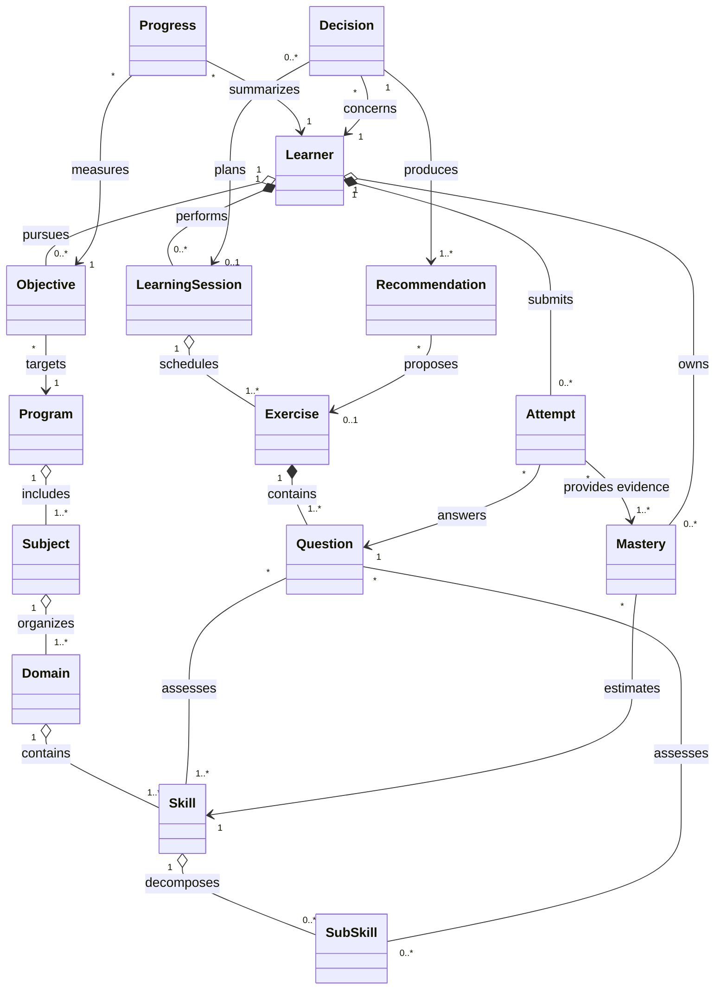

# Architecture Domain Model

Statut : référence Architecture Blueprint v1.0

## Vocabulaire canonique

- **Program** : programme pédagogique ou examen versionné pour un pays, une juridiction et une période.
- **Subject** : matière enseignée dans un `Program`.
- **Domain** : regroupement cohérent de compétences au sein d'une matière.
- **Skill** : capacité mesurable attendue.
- **SubSkill** : capacité atomique rattachée à une `Skill`.
- **Exercise** : unité pédagogique avec objectif, consignes, durée, difficulté et stratégie d'évaluation.
- **Question** : item évaluable appartenant à un exercice.
- **Learner** : utilisateur ayant un profil apprenant.
- **LearningSession** : période bornée de travail contenant des exercices ordonnés.
- **Attempt** : soumission d'une réponse à une question.
- **Mastery** : estimation versionnée de maîtrise d'une compétence.
- **Progress** : projection de progression vers un programme ou un objectif.
- **Objective** : résultat visé avec cible et échéance.
- **Decision** : choix explicable produit par le `Decision Engine`.
- **Recommendation** : proposition présentée à l'apprenant à partir d'une décision.

## Hiérarchie pédagogique

La hiérarchie obligatoire est :

```text
Program
└── Subject
    └── Domain
        └── Skill
            └── SubSkill
```

Exemples :

```text
Brevet 2027 (France)
└── Mathematics
    └── Geometry
        └── Thales Theorem
            └── Direct Case

Brevet 2027 (France)
└── French
    └── Language Study
        └── Complex Sentences
            └── Identify Subordinate Clauses

GCSE 2028 (England)
└── Mathematics
    └── Algebra
        └── Linear Equations
            └── Solve One-variable Equations
```

`Program` rend possibles plusieurs niveaux, examens, pays et versions sans dupliquer l'identité globale d'une matière. Les associations programme–matière–domaine portent ordre, coefficient et attentes locales. Les codes stables sont séparés des libellés traduits. Une même `Skill` conceptuelle peut être alignée entre programmes tout en conservant des exigences, exemples et niveaux différents.

## Modèle logique



Le diagramme représente les relations métier, pas nécessairement chaque table physique. `Subject` et `Domain` peuvent être réutilisés entre programmes via des associations versionnées en base. Une `Question` évalue au moins une `Skill`; les liens vers `SubSkill` précisent les preuves atomiques.

## Exercise et Question

### Exercise

Un `Exercise` est le conteneur pédagogique présenté comme une unité cohérente :

- `title` : titre affichable;
- `objective` : résultat pédagogique attendu;
- `estimated_duration` : durée cible de l'ensemble;
- `difficulty` : niveau calibré et versionné;
- `instructions` : consignes communes;
- `evaluation_strategy` : agrégation des questions, seuils, score partiel et règles de réussite.

### Question

Une `Question` est l'unité de réponse et de preuve :

- `statement` : énoncé;
- `expected_answer` : réponse structurée attendue;
- `explanation` : correction approuvée;
- `hints` : indices ordonnés et graduels;
- `linked_skills` : compétences évaluées, poids et caractère principal.

Cardinalités : un `Exercise` contient **une à plusieurs** `Question`; une `Question` appartient à **un** `Exercise` dans une version de contenu; une `Question` évalue **une à plusieurs** `Skill`/`SubSkill`; une compétence peut être évaluée par **plusieurs** questions. Une `Attempt` répond à une question précise et conserve les versions de contenu et de stratégie d'évaluation.

## Invariants

- Une `SubSkill` appartient à exactement une `Skill`; une `Skill` appartient à un `Domain` dans le référentiel considéré.
- Toute entité de référentiel possède un code stable, un libellé et une version/validité.
- Un exercice actif contient au moins une question active et une stratégie d'évaluation valide.
- Une tentative ne change jamais de question après création.
- Une maîtrise courante est une projection reconstructible depuis les preuves.
- Une recommandation est toujours reliée à une décision versionnée et explicable.
- Une décision n'écrit pas directement le contenu ou la maîtrise; elle sélectionne et ordonne à partir d'un état donné.

