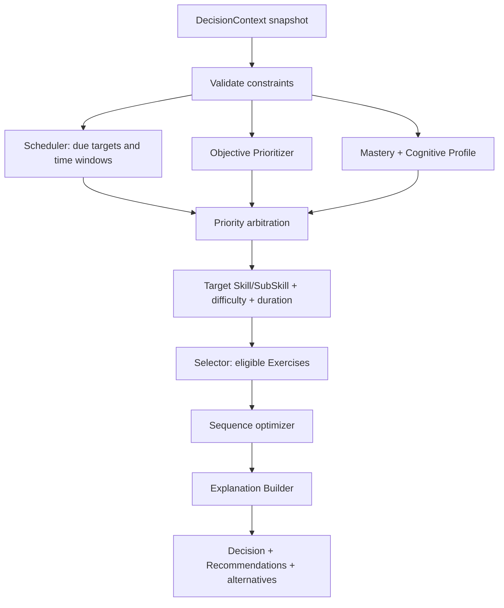

# Decision Engine

Statut : référence Architecture Blueprint v1.0

## Rôle

Le **Decision Engine** est l'orchestrateur déterministe du parcours adaptatif. Il décide :

- **quoi** proposer : compétence, exercice ou remédiation;
- **pourquoi** : facteurs, règles et alternatives;
- **quand** : maintenant ou à une échéance;
- **dans quel ordre** : séquence d'activités;
- **à quelle difficulté** : zone de défi adaptée;
- **pendant combien de temps** : budget de session et durée des activités.

Il ne rend pas l'interface, ne génère pas de texte libre, ne lit pas directement DuckDB et ne modifie pas le référentiel. Le cas d'usage lui fournit un snapshot; il retourne un `Decision` immuable à persister.

## Composants et responsabilités

| Composant | Responsabilité exclusive |
|---|---|
| `Decision Engine` | Orchestrer contraintes, objectifs, profil cognitif, maîtrise, calendrier et contenus; arbitrer et expliquer. |
| `Scheduler` | Calculer les échéances, activités dues, fenêtres disponibles et contraintes calendaires. Il ne choisit pas le contenu. |
| `Selector` | Filtrer et classer les contenus éligibles pour une cible, une difficulté et une durée. Il ne décide pas du calendrier global. |
| `Mastery Model` | Mettre à jour/récupérer maîtrise, confiance, rétention et oubli. |
| `Cognitive Profile` | Fournir les caractéristiques d'apprentissage estimées et leur confiance. |
| `Objective Prioritizer` | Convertir objectifs, poids et échéances en urgence pédagogique. |
| `Explanation Builder` | Transformer facteurs et règles en raisons structurées, sans LLM. |

## Fonctionnement

1. Valider identité, autorisation, temps disponible et règles du `Program`.
2. Demander au `Scheduler` les cibles dues et les fenêtres pertinentes.
3. Évaluer lacunes de `Mastery`, prérequis, objectifs et signaux fiables du profil cognitif.
4. Calculer une priorité par cible; conserver chaque contribution.
5. Déterminer difficulté et durée compatibles avec la cible et la session.
6. Demander au `Selector` les `Exercise` éligibles; exclure contenu récent, archivé ou hors programme.
7. Ordonner pour gérer prérequis, variété, fatigue estimée et charge cognitive.
8. Produire la décision, les recommandations présentables, les alternatives et les raisons.

## Contrats

Entrée `DecisionContext` : apprenant, `Program`, objectifs actifs, `Mastery`, profil cognitif avec confiance, erreurs récurrentes, historique récent, calendrier, temps disponible, contraintes de session, catalogue éligible, horloge, versions de règles.

Sortie `Decision` : type, cible, contenu ordonné, difficulté, durée, moment, scores de priorité, raisons, alternatives, règles appliquées, graine de départage, version moteur et identifiant de corrélation.

## Règles d'arbitrage

Ordre de sûreté : contraintes obligatoires → prérequis → révisions dues → objectifs proches → lacunes → exploration/variété. Le poids exact est versionné. Un indicateur cognitif à faible confiance ne peut écarter un contenu; il apporte au plus un faible bonus/malus.

Les conflits sont explicites : une échéance proche peut augmenter la priorité, mais ne contourne pas un prérequis critique; une fatigue estimée réduit la durée ou réordonne, mais ne marque pas une compétence comme maîtrisée; une modalité préférée guide le choix tout en maintenant une exploration minimale.

## Explicabilité, déterminisme et audit

À contexte, horloge et graine identiques, la décision est reproductible. `learning_decisions` conserve snapshot/hashes, candidats, scores, sélection, règles et alternatives. Les recommandations utilisent des codes tels que `REVIEW_DUE`, `OBJECTIVE_SOON`, `PREREQUISITE_GAP`, `ERROR_RECURRING`, `SESSION_TIME_LIMIT`.

L'AI Coach peut reformuler l'explication, jamais modifier la décision. Une décision devenue invalide expire et est recalculée plutôt que réécrite.

## Modes d'exploitation et tests

- `disabled` : parcours historique;
- `shadow` : décisions calculées et journalisées, non appliquées;
- `assisted` : recommandation visible mais choix final laissé à l'apprenant;
- `active` : séquence appliquée avec possibilité de refus.

Tests : invariants et bornes; conflits de règles; reproductibilité; absence de famine d'une compétence; respect du budget temps; simulation longitudinale; scénarios pédagogiques validés; comparaison shadow; tests de performance sur catalogues représentatifs.

