# DuckDB V2 — modèle de données implémenté

Statut : implémenté par LCAI-0004
Fichier : `data/learning_coach_v2.duckdb`
Migrations : `migrations/v2/`

## Principes

DuckDB V2 reste séparé de V1. Depuis LCAI-0010B, le shell unifié utilise V1
uniquement pour l'authentification historique pendant la migration progressive
et conserve les données pédagogiques nouvelles dans V2.

Le modèle suit la hiérarchie canonique `Program → Subject → Domain → Skill → SubSkill`, sépare `Exercise` et `Question`, conserve les événements d'apprentissage et prépare les futurs Learning Engine, Decision Engine et AI Coach sans les implémenter.

## Identifiants

- Toutes les entités utilisent un `BIGINT` issu de `global_entity_id_seq`.
- La séquence commence à `100000` afin de réserver les identifiants inférieurs aux référentiels versionnés.
- Les seeds possèdent donc des IDs déterministes (`Program` 1, matières 1–10, compétences 10001+).
- Les tables d'association utilisent une clé primaire composite, car elles n'ont pas d'identité métier autonome.
- Les codes fonctionnels sont stables et uniques dans leur contexte; les libellés restent traduisibles.

Cette stratégie est adaptée à un fichier local. Une synchronisation multi-instance imposerait de réévaluer le choix en faveur d'UUID.

## Inventaire du schéma

Après LCAI-0010B, le schéma contient **115 tables**, **7 vues** et
**66 index explicites**.

### Versionnement et référentiels

| Table | Responsabilité | Relations et contraintes principales |
|---|---|---|
| `schema_versions` | Journal des migrations | PK `version`, checksum unique, durée positive |
| `school_levels` | Niveaux scolaires par pays | code unique, rang positif, code pays à 2 caractères |
| `programs` | Programmes/examens versionnés | unique `(code, version, country_code)`, validité temporelle cohérente |
| `subjects` | Matières réutilisables | code unique |
| `program_subjects` | Matières d'un programme/niveau | FK vers les trois référentiels, PK composite, ordre unique |
| `domains` | Domaines d'une matière | FK `subject_id`, code et ordre uniques par matière |
| `skills` | Compétences mesurables | FK `domain_id`, code et ordre uniques par domaine |
| `subskills` | Sous-compétences atomiques | FK `skill_id`, code et ordre uniques par compétence |
| `program_skills` | Attentes d'un programme | PK programme/compétence, maîtrise `[0,1]`, priorité positive |
| `skill_prerequisites` | Prérequis pondérés | deux FK vers `skills`, pas d'auto-prérequis |
| `reference_translations` | Libellés multilingues | PK type/entité/langue; types d'entités contrôlés |

### Gestion de contenu (LCAI-0005)

| Table | Responsabilité |
|---|---|
| `content_versions` | Snapshots versionnés avec auteur et statut initial |
| `content_status_events` | Historique append-only des transitions de statut |
| `media_assets` | Métadonnées d'images, PDF, audio, vidéo et liens |
| `tags` / `content_tags` | Taxonomie et associations de contenus |
| `validation_runs` / `validation_issues` | Rapports qualité détaillés |

### Apprenant et objectifs

| Table | Responsabilité | Relations et contraintes principales |
|---|---|---|
| `learners` | Identité pédagogique minimale | référence externe unique, locale et fuseau; aucune donnée seedée |
| `learner_profiles` | Learner Cognitive Profile courant | PK/FK apprenant; indicateurs `[0,1]`; temps de réponse positif; JSON de confiance |
| `objectives` | Objectifs datés | FK apprenant/programme; type et statut contrôlés; cible `[0,1]` |
| `objective_skills` | Compétences ciblées | PK objectif/compétence; poids positif; cible `[0,1]` |

### Contenu pédagogique

| Table | Responsabilité | Relations et contraintes principales |
|---|---|---|
| `exercises` | Unité pédagogique | FK matière; code/langue/version unique; difficulté 1–5; durée positive; stratégie JSON |
| `questions` | Item évaluable | code/langue/version unique; type de réponse contrôlé; réponse et indices JSON |
| `exercise_questions` | Questions ordonnées d'un exercice | PK exercice/question; position unique; points positifs |
| `question_skills` | Compétences évaluées | PK question/compétence; poids positif; indicateur principal |
| `question_subskills` | Sous-compétences évaluées | PK question/sous-compétence; poids positif |

Un `Exercise` contient une à plusieurs `Question` au niveau métier. La base garantit l'unicité et l'ordre des associations; le contrôle « au moins une question avant activation » reste une règle applicative transactionnelle.

### Sessions et preuves

| Table | Responsabilité | Relations et contraintes principales |
|---|---|---|
| `learning_sessions` | Session planifiée ou réalisée | FK apprenant/objectif; type et statut contrôlés; dates cohérentes |
| `session_exercises` | Exercices ordonnés présentés | FK session/exercice/décision; position unique par session |
| `attempts` | Soumission immuable | FK apprenant/question/session; score `[0,1]`; difficulté 1–5; snapshots JSON |
| `error_categories` | Taxonomie d'erreurs | code unique; quatre catégories seedées |
| `attempt_skill_results` | Preuve par compétence | PK tentative/compétence; preuve `[0,1]`; catégorie d'erreur optionnelle |

### Maîtrise, décisions et progression

| Table | Responsabilité | Relations et contraintes principales |
|---|---|---|
| `mastery_current` | Projection courante de maîtrise | PK apprenant/compétence; score et confiance `[0,1]`; demi-vie positive |
| `mastery_events` | Historique append-only | FK apprenant/compétence/tentative; scores et preuve `[0,1]`; facteurs JSON |
| `learning_decisions` | Décisions externes journalisées | FK apprenant/session; inputs, candidats, scores et raisons JSON; version/corrélation |
| `recommendations` | Recommandations issues d'une décision | FK apprenant/décision et cible; priorité `[0,1]`; statut contrôlé |
| `progress_snapshots` | Progression calculée | FK apprenant/programme/objectif; score `[0,1]`; compteurs cohérents |
| `study_calendar` | Calendrier de travail | FK apprenant/objectif/compétence; durée positive; statut/source contrôlés |
| `revision_history` | Historique de révision | FK apprenant/compétence/session/tentative; résultat `[0,1]`; intervalles positifs |
| `learning_metrics` | Mesures longitudinales génériques | FK apprenant/session; dimensions JSON; unicité temporelle de la métrique |

### Mémoire IA

| Table | Responsabilité | Relations et contraintes principales |
|---|---|---|
| `ai_conversation_memory` | Projection pédagogique temporaire | FK apprenant/décision; résumé et sources JSON; expiration obligatoire; fenêtre cohérente |

Cette table ne constitue pas une mémoire permanente du LLM. Elle stocke des projections applicatives expirables; aucun échange IA ou prompt n'est créé par LCAI-0004.

## Diagramme ER

```mermaid
erDiagram
    PROGRAMS ||--o{ PROGRAM_SUBJECTS : includes
    SCHOOL_LEVELS ||--o{ PROGRAM_SUBJECTS : targets
    SUBJECTS ||--o{ PROGRAM_SUBJECTS : participates
    SUBJECTS ||--o{ DOMAINS : organizes
    DOMAINS ||--o{ SKILLS : contains
    SKILLS ||--o{ SUBSKILLS : decomposes
    PROGRAMS ||--o{ PROGRAM_SKILLS : expects
    SKILLS ||--o{ PROGRAM_SKILLS : required_by
    SKILLS ||--o{ SKILL_PREREQUISITES : requires
    SKILLS ||--o{ SKILL_PREREQUISITES : prerequisite

    LEARNERS ||--o| LEARNER_PROFILES : has
    LEARNERS ||--o{ OBJECTIVES : pursues
    PROGRAMS ||--o{ OBJECTIVES : targeted_by
    OBJECTIVES ||--o{ OBJECTIVE_SKILLS : targets
    SKILLS ||--o{ OBJECTIVE_SKILLS : measured_by

    SUBJECTS ||--o{ EXERCISES : owns
    EXERCISES ||--|{ EXERCISE_QUESTIONS : contains
    QUESTIONS ||--o{ EXERCISE_QUESTIONS : included_in
    QUESTIONS ||--|{ QUESTION_SKILLS : assesses
    SKILLS ||--o{ QUESTION_SKILLS : evidenced_by
    QUESTIONS ||--o{ QUESTION_SUBSKILLS : refines
    SUBSKILLS ||--o{ QUESTION_SUBSKILLS : evidenced_by

    LEARNERS ||--o{ LEARNING_SESSIONS : performs
    OBJECTIVES ||--o{ LEARNING_SESSIONS : guides
    LEARNING_SESSIONS ||--o{ SESSION_EXERCISES : schedules
    EXERCISES ||--o{ SESSION_EXERCISES : presented_as
    LEARNERS ||--o{ ATTEMPTS : submits
    QUESTIONS ||--o{ ATTEMPTS : answered_by
    SESSION_EXERCISES ||--o{ ATTEMPTS : receives
    ATTEMPTS ||--o{ ATTEMPT_SKILL_RESULTS : produces
    SKILLS ||--o{ ATTEMPT_SKILL_RESULTS : receives

    LEARNERS ||--o{ MASTERY_CURRENT : owns
    SKILLS ||--o{ MASTERY_CURRENT : estimates
    ATTEMPTS ||--o{ MASTERY_EVENTS : triggers
    LEARNERS ||--o{ LEARNING_DECISIONS : concerns
    LEARNING_DECISIONS ||--o{ RECOMMENDATIONS : produces
    LEARNERS ||--o{ PROGRESS_SNAPSHOTS : tracks
    LEARNERS ||--o{ STUDY_CALENDAR : plans
    LEARNERS ||--o{ REVISION_HISTORY : reviews
    LEARNERS ||--o{ LEARNING_METRICS : measures
    LEARNERS ||--o{ AI_CONVERSATION_MEMORY : contextualizes
```



## Index explicites

| Index | Justification |
|---|---|
| `idx_exercises_subject_status_difficulty` | sélectionner un contenu éligible |
| `idx_questions_status` | filtrer les questions actives |
| `idx_learning_sessions_learner_started` | historique d'un apprenant |
| `idx_attempts_learner_submitted` | preuves chronologiques |
| `idx_attempts_question_submitted` | analyse d'un item |
| `idx_mastery_current_learner_review` | révisions dues |
| `idx_mastery_events_learner_skill_event` | reconstruction de maîtrise |
| `idx_decisions_learner_created` | audit des décisions |
| `idx_recommendations_learner_status_created` | recommandations actives |
| `idx_progress_learner_calculated` | progression longitudinale |
| `idx_calendar_learner_status_scheduled` | calendrier à venir |
| `idx_revision_learner_skill_reviewed` | répétition espacée future |
| `idx_metrics_learner_name_measured` | séries de métriques |

Les index automatiques associés aux PK/UNIQUE ne sont pas dupliqués. Ces index devront être réévalués par `EXPLAIN` lorsque des volumes représentatifs existeront.

## Migrations

| Version | Fichier | Contenu |
|---:|---|---|
| 1 | `001_initial_schema.sql` | séquence, 34 tables, PK/FK/UNIQUE/CHECK/NOT NULL |
| 2 | `002_seed_reference.sql` | programme Brevet 2027, niveau, 10 matières, 21 domaines, 25 compétences, sous-compétences, prérequis et traductions |
| 3 | `003_views.sql` | catalogue de compétences, progression, révisions dues |
| 4 | `004_indexes.sql` | 13 index métier ciblés |
| 5 | `005_content_management.sql` | Versionnement, médias, tags, validation et 5 index associés |
| 6 | `006_content_media_links.sql` | Associations ordonnées entre contenus et médias |
| 7 | `007_longitudinal_learning.sql` | Parcours, idempotence, maîtrise longitudinale, événements et readiness |
| 8 | `008_decision_engine.sql` | Journey détaillé, objectifs, plan ordonné et snapshots de décision |
| 9 | `009_onboarding_content_recommendation.sql` | Onboarding, versions de Journey, candidats et séances personnalisées |
| 10 | `010_curriculum_approved_content.sql` | Curriculum, graphe, catalogue éditorial, approbations et vue Approved |
| 11 | `011_learning_session_domain.sql` | Exécution de session, réponses, évaluations, tentatives liées, checkpoints et audit |
| 12 | `012_session_integration_security.sql` | Idempotence, autorisations, versions gelées, concurrence, reprise décisionnelle et vues de session |
| 13 | `013_learning_intelligence_layer.sql` | Calculs analytiques, snapshots, explications, erreurs récurrentes et insights parent versionnés |
| 14 | `014_platform_extensibility_foundation.sql` | Statuts de plugins, snapshots non secrets, outbox locale, livraisons idempotentes, audit append-only et traces import/export/notification |
| 15 | `015_unified_learning_experience.sql` | Profils d’expérience, devoirs, résultats, changements de programme et mesure d’efficacité |
| 16 | `016_supported_school_levels.sql` | Niveaux CM1 à 5e et adresse e-mail du profil apprenant |

Le runner :

- découvre des versions contiguës;
- calcule un SHA-256 du SQL;
- exécute chaque migration dans une transaction;
- rollback en cas d'erreur;
- refuse la modification d'une migration déjà appliquée;
- permet une reconstruction complète et idempotente.

Commande :

```console
python -m migrations --database data/learning_coach_v2.duckdb
```

## Données de référence

V2 contient les référentiels historiques et le lot éditorial ciblé LCAI-0009 :
34 chapitres, 34 compétences détaillées, 34 sous-compétences, 38 relations et
68 contenus Approved. Ce lot couvre partiellement la 4e, la transition vers la 3e,
la 3e et la préparation au brevet ; il n'est pas présenté comme un programme complet.
Les tables apprenant et les tables d'activité restent vides dans le fichier livré.

## Migration V1 ultérieure

| V1 | V2 cible | Statut LCAI-0004 |
|---|---|---|
| `users` | `learners` et futur service d'identité | non migré |
| `exams` | `learning_sessions`, `exercises` | non migré |
| `exam_questions` | `questions`, `exercise_questions`, `attempts` | non migré |
| `practice_attempts` | `attempts`, `attempt_skill_results` | non migré |
| `learning_sessions` | `learning_sessions` | non migré |

La migration de données exigera une table de provenance, un mapping pédagogique validé et un traitement séparé des credentials. Elle ne doit jamais être déduite automatiquement des libellés.
