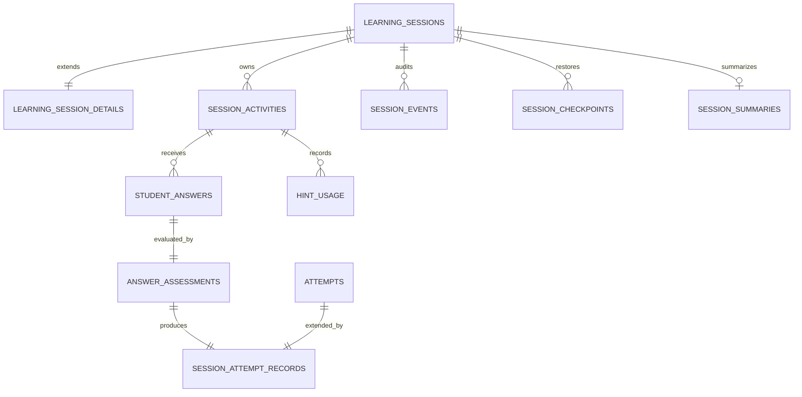

# Learning Session — Domain Model and Persistence

Statut : implémenté par LCAI-0010 Part 02  
Migration : `011_learning_session_domain.sql`

## Modèle

Le bounded context persiste les entités suivantes :

- `LearningSession` ;
- `SessionActivity` ;
- `StudentAnswer` ;
- `Assessment` ;
- `Attempt` ;
- `HintUsage` ;
- `SessionEvent` ;
- `SessionCheckpoint` ;
- `SessionSummary`.

Les enums de statut, types de réponse et méthodes d’évaluation sont des valeurs
métier stables. Le domaine rejette les durées négatives, pourcentages hors
bornes, maîtrises hors `[0,1]` et transitions invalides avant la persistance.

## Compatibilité avec le schéma antérieur

Les tables `learning_sessions`, `session_exercises` et `attempts` existaient
avant LCAI-0010. Elles ne sont ni supprimées, ni renommées, ni recréées.

- `learning_session_details` complète `learning_sessions` en relation 1:1 ;
- `session_activities` porte le nouveau modèle d’activité, sans retirer
  `session_exercises` ;
- toute tentative Part 02 crée encore une ligne immutable dans `attempts` ;
- `session_attempt_records` relie cette tentative historique à la réponse et à
  l’évaluation du nouveau contexte.

DuckDB interdit la mise à jour de certaines lignes parentes référencées même
lorsque leur clé ne change pas. Le statut d’exécution canonique est donc stocké
dans `learning_session_details`; le champ historique de `learning_sessions`
reste compatible avec son ancien contrat.

## Transaction d’évaluation

Le repository persiste dans une transaction unique :

1. la réponse validée ;
2. l’évaluation ;
3. la tentative historique ;
4. la relation de tentative du bounded context ;
5. l’audit de mise à jour de maîtrise.

Une erreur annule les cinq écritures. La clé d’idempotence de la réponse empêche
les doubles tentatives.

Le calcul de maîtrise n’est pas implémenté dans ce contexte. Le champ
`session_mastery_updates.update_payload` conserve le résultat transmis par le
Learning Engine et sa version afin de rendre le cycle reproductible.

## Versionnement et audit

Chaque session conserve :

- version applicative ;
- version du curriculum ;
- version du contenu ;
- version du Decision Engine ;
- version de l’Assessment Engine.

Les actions significatives utilisent `session_events`. Les réponses, événements
et tentatives sont archivables mais ne sont jamais supprimés.

