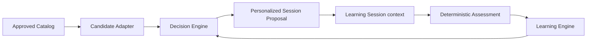
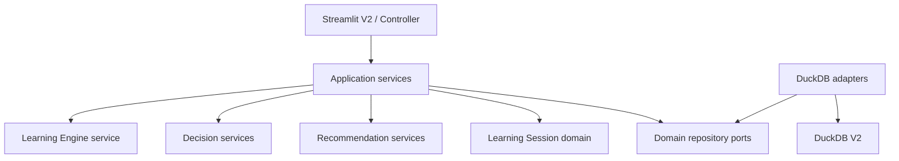
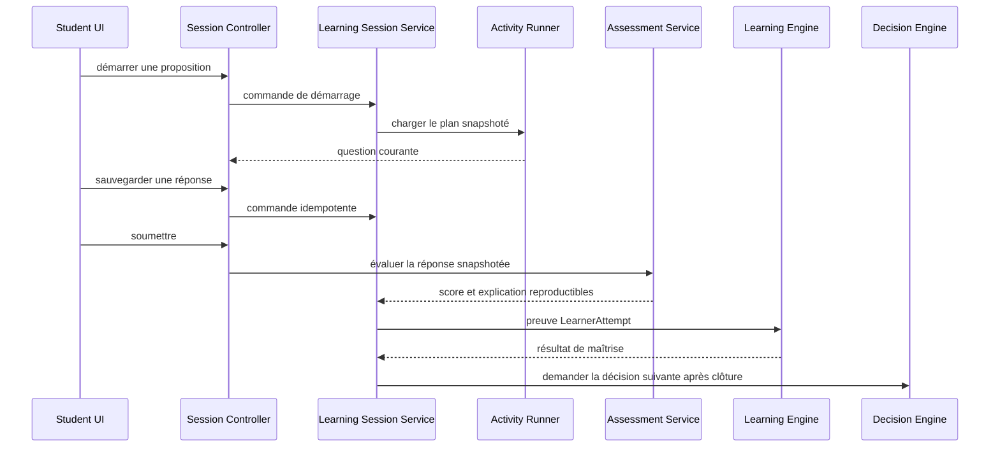

# Learning Session — Foundation Architecture

Statut : spécification d’architecture LCAI-0010 Part 01 v1.1  
Portée : architecture uniquement, sans modèle métier, migration, repository, service ou interface supplémentaire  
Branche cible : `develop`

## 1. Décision d’architecture

LCAI-0010 introduit le bounded context **Learning Session** par évolution additive de V2. Il transforme une proposition pédagogique déjà produite par LCAI-0008 en exécution traçable, sans remplacer les moteurs existants.

La séparation retenue est la suivante :

- le Recommendation Engine filtre les contenus Approved et construit les candidats ;
- le Decision Engine choisit et ordonne les activités ;
- le contexte Learning Session exécute le plan choisi et collecte les actions ;
- le moteur d’évaluation déterministe produit les preuves factuelles ;
- le Learning Engine reste seul responsable du calcul longitudinal de maîtrise ;
- une nouvelle décision n’est demandée qu’après traitement des preuves.

Une `PersonalizedSessionProposal` est un plan proposé. Elle ne devient pas implicitement une session exécutée. Cette distinction préserve la reproductibilité, évite de confondre planification et activité réelle et permet de reprendre ou abandonner une exécution sans altérer la décision d’origine.

## 2. Contexte existant audité

### Composants réutilisables

| Besoin futur | Composant existant | Décision Part 01 |
|---|---|---|
| Contenus exécutables | `approved_learning_catalog` et `DuckDBRecommendationRepository.load_approved_contents()` | Réutiliser ; ne jamais charger Draft, Review ou Archived |
| Plan de séance | `PersonalizedSessionProposal` et `personalized_session_items` | Utiliser comme source immuable de l’exécution |
| Sélection et ordonnancement | `ContentCandidateService`, `DecisionEngineService`, `PersonalizedSessionService` | Ne pas contourner ni dupliquer |
| Explicabilité de la décision | `LearningDecision`, `DecisionExplanation`, snapshots de décision | Conserver les identifiants et raisons dans la chaîne d’audit |
| Signal d’apprentissage | `LearnerAttempt`, `AttemptEvaluation`, `LearningEngineService` | Adapter les réponses évaluées vers ce contrat ; ne pas recalculer la maîtrise ailleurs |
| Maîtrise longitudinale | `DuckDBLearningRepository` et projections de maîtrise | Laisser au Learning Engine la responsabilité exclusive |
| Persistance générique V2 | `connect_v2`, migration runner, repositories DuckDB | Réutiliser derrière des ports du domaine |
| Sessions et tentatives historiques | `learning_sessions`, `session_exercises`, `attempts` | Auditer en Part 02 avant toute extension ; aucune table homonyme |
| Activation optionnelle | `LCAI_ENABLE_V2_UI`, `LCAI_ENABLE_V2_ADMIN`, `v2_app.py` | V1 reste le défaut ; toute expérience Learning Session reste explicitement activée |

### Contraintes observées

- V1 s’appuie encore sur `core/` et `ui/streamlit_app.py` ; ce chemin ne doit pas importer le bounded context V2.
- `v2_app.py` orchestre actuellement onboarding et proposition. Il ne doit pas recevoir de logique de session ou d’évaluation.
- `infrastructure/repositories/v2.py` expose déjà des repositories génériques de session et tentative, tandis que les moteurs récents ont des adapters spécialisés. Part 02 devra choisir une évolution progressive, pas une troisième implémentation concurrente.
- Les tables `learning_sessions` et `attempts` existent depuis la migration initiale. Toute migration ultérieure doit commencer par une matrice champ requis/champ existant.
- Les événements du Learning Engine sont déjà persistables. Les actions d’interface et les résultats d’évaluation doivent rester distincts des événements de maîtrise.

## 3. Frontière du bounded context

### Responsabilité

Le contexte Learning Session possède l’exécution temporelle et interactive d’un plan :

- démarrage et cycle de vie d’une session ;
- progression dans les activités et questions ;
- collecte et sauvegarde des réponses ;
- pause et reprise ;
- consommation d’indices ;
- mesure des durées ;
- évaluation déterministe ;
- constitution de preuves d’apprentissage ;
- résumé de session et audit des actions.

### Hors responsabilité

Il ne possède pas :

- l’approbation des contenus ;
- le choix pédagogique initial ;
- la formule de maîtrise ;
- la prochaine recommandation ;
- la génération de contenu ;
- la correction sémantique ou probabiliste ;
- l’authentification ;
- les fonctionnalités V1.

## 4. Composants majeurs

Les noms ci-dessous définissent les responsabilités architecturales demandées. Ils ne constituent pas des classes créées par la Part 01.

| Composant | Responsabilité unique | Dépendances autorisées |
|---|---|---|
| Session Controller | Traduire les intentions UI en commandes applicatives et retourner des vues | Services applicatifs uniquement |
| Learning Session Service | Orchestrer le cycle de vie et faire respecter les transitions | Ports de session, horloge explicite |
| Activity Runner | Exposer l’activité courante et progresser selon le plan immuable | Contenu snapshoté, état de session |
| Assessment Service | Comparer une réponse aux règles Approved de manière déterministe | Règles d’évaluation et snapshots attendus |
| Mastery Update Service | Adapter une évaluation validée en `LearnerAttempt` puis déléguer | `LearningEngineService` |
| Session Scheduler | Préparer un démarrage depuis une proposition valide | Proposition et disponibilité existantes |
| Resume Service | Reconstruire l’état courant depuis les données persistées | Repository de session et journal d’actions |
| Auto Save Service | Persister une réponse idempotente sans l’évaluer implicitement | Repository de réponse |

## 5. Couches et dépendances

Règles :

1. Le domaine n’importe ni Streamlit, ni DuckDB, ni `services`, ni `infrastructure`.
2. Les services applicatifs dépendent de ports explicites.
3. Les adapters DuckDB implémentent les ports et ne contiennent aucune règle pédagogique.
4. Streamlit ne contient ni SQL, ni formule de score, ni transition d’état.
5. Les dépendances vers Recommendation, Decision et Learning passent par leurs services publics.
6. L’horloge et les identifiants nécessaires au déterminisme sont injectés ou passés explicitement.

## 6. Flux d’exécution de référence

Ce diagramme fixe l’ordre des responsabilités, pas les signatures ni le schéma de la Part 02.

## 7. Principes déterministes

- Un contenu est identifié par `content_id` et `content_version_id`.
- L’énoncé, la réponse attendue et la règle de correction utilisés doivent être snapshotés ou référencés immuablement.
- Une réponse identique, avec les mêmes snapshots et la même version de règles, produit le même résultat.
- Le temps, les indices et le nombre d’essais sont des entrées explicites, jamais des dépendances cachées.
- L’auto-save ne déclenche pas de correction.
- Une soumission répétée avec la même clé d’idempotence ne crée pas une seconde tentative.
- Aucun LLM, rapprochement sémantique ou tirage aléatoire opaque n’est autorisé.

## 8. Trace et observabilité

Trois familles de traces doivent rester séparées :

1. **Actions de session** : démarrage, navigation, réponse sauvegardée, indice, pause, reprise, soumission et clôture.
2. **Évaluation** : inputs snapshotés, version de règle, score, correction et explication.
3. **Apprentissage** : événements et projections produits par le Learning Engine.

Chaque chaîne doit conserver des identifiants de corrélation vers :

- la proposition ;
- la décision ;
- la session ;
- l’activité ;
- la question et sa version ;
- la tentative ;
- le résultat du Learning Engine.

Les réponses peuvent contenir des données personnelles ou du travail scolaire. Les logs techniques ne doivent contenir ni réponse brute, ni secret, ni donnée de profil inutile.

## 9. Compatibilité et migration progressive

- `app.py` et la base V1 restent inchangés.
- V2 demeure isolée et désactivée par défaut.
- Les tables existantes ne seront ni renommées ni supprimées.
- Part 02 devra privilégier des colonnes ou tables additives et préserver les repositories actuels tant que l’équivalence n’est pas démontrée.
- La proposition LCAI-0008 reste lisible sans création automatique de session.
- Les scénarios historiques et snapshots de décision restent reproductibles.

## 10. Points d’intégration validés

| Source | Contrat d’entrée du futur contexte | Résultat attendu |
|---|---|---|
| Approved Catalog | contenu/version active, question, correction, difficulté, durée | Snapshot exécutable |
| Personalized Session | proposition, items ordonnés, budget, objectif, explications | Plan de session immuable |
| Decision Engine | décision et identifiant de corrélation | Traçabilité du choix |
| Learning Engine | `LearnerAttempt` déterministe | Maîtrise et readiness mises à jour |
| Onboarding/Journey | apprenant, niveau, objectif et contraintes | Validation du propriétaire et du contexte |
| Streamlit V2 | commandes utilisateur validées | DTO de présentation sans logique métier |

## 11. Risques architecturaux

| Risque | Mesure imposée |
|---|---|
| Confusion proposition/session | Identités et cycles de vie distincts |
| Double calcul de maîtrise | Délégation obligatoire au `LearningEngineService` |
| Double repository de session | Audit comparatif obligatoire en Part 02 |
| Contenu modifié pendant une session | Référence de version et snapshots immuables |
| Double soumission ou auto-save concurrent | Clés d’idempotence et transaction repository |
| Couplage Streamlit/DuckDB | Controller et services applicatifs obligatoires |
| Fuite de réponses dans les logs | Métadonnées minimales et politique de redaction |
| Régression V1 | Feature flag V2 et tests de démarrage séparés |

## 12. Roadmap d’implémentation

### Jalon actuel — Part 01

- architecture documentée ;
- composants existants et points d’intégration audités ;
- responsabilités et dépendances validées ;
- risques et règles de migration explicités ;
- aucune logique ou persistance inachevée.

### Prochain jalon — Part 02

Après validation technique de la Part 01 uniquement :

1. lire la spécification Part 02 alors en vigueur ;
2. réauditer le schéma et les repositories de session/tentative ;
3. définir le modèle et les ports strictement requis par cette spécification ;
4. appliquer une évolution additive et testée ;
5. ne pas anticiper orchestration, évaluation ou UI au-delà de Part 02.

Les jalons ultérieurs ne sont pas détaillés ici afin de respecter l’interdiction d’anticiper les documents futurs.

## 13. Validation d’architecture Part 01

| Critère | Résultat |
|---|---|
| Nouveau bounded context identifié | Conforme |
| Recommendation et Decision Engine non contournés | Conforme |
| Learning Engine propriétaire de la maîtrise | Conforme |
| Responsabilités UI limitées à l’orchestration | Conforme |
| SQL interdit dans Streamlit | Conforme |
| Ports et inversion de dépendance exigés | Conforme |
| Déterminisme, explicabilité et audit définis | Conforme |
| V1 préservée et V2 optionnelle | Conforme |
| Réutilisation avant création | Conforme |
| Aucun code ou schéma spéculatif | Conforme |

