# Roadmap vers la Release 1.0

Statut : ordre de référence Architecture Blueprint v1.0

## Tickets

| Ticket | Objet | Dépend de | Critères de sortie |
|---|---|---|---|
| LCAI-0002 | **Infrastructure Cleanup** | 0001A | Configuration centralisée, sécurité immédiate, connexion DuckDB maîtrisée, outils Python 3.14/CI et baseline de caractérisation. |
| LCAI-0003 | **Architecture Refactoring** | 0002 | Frontières UI/application/domain/infrastructure, ports/repositories, cas d'usage critiques extraits sans régression. |
| LCAI-0004 | **DuckDB V2** | 0002–0003 | Framework de migrations, DDL V2, contraintes/index, dry-run, sauvegarde/restauration et réconciliation des trois bases sur copies. |
| LCAI-0005 | **Domain Model** | 0003–0004 | `Program → Subject → Domain → Skill → SubSkill`, `Exercise/Question`, codes/versionnement et mappings historiques validés. |
| LCAI-0006 | **Learning Engine** | 0005 | `Mastery`, confiance, oubli et Learner Cognitive Profile versionnés, reconstructibles, calibrés et testés. |
| LCAI-0007 | **Decision Engine** | 0005–0006 | Orchestrateur, Scheduler et Selector séparés; décisions reproductibles, journalisées, expliquées et disponibles en shadow mode. |
| LCAI-0008 | **AI Coach** | 0002–0003, 0007 | Gouvernance mineurs validée, contexte factuel, Conversation Memory, prompts versionnés, fournisseur abstrait, validation et fallback. |
| LCAI-0009 | **Adaptive Recommendation Engine** | 0006–0008 | Recommandations longitudinales utilisant maîtrise, profil, objectifs et décisions; calibration offline et activation contrôlée. |
| LCAI-0010 | **UI / Streamlit V2** | 0003, 0007–0009 | Pages/composants séparés, DTO/cas d'usage uniquement, parcours élève/parent accessibles, feature flags intégrés. |
| LCAI-0011 | **Dashboards** | 0004–0006, 0009–0010 | Projections analytics cohérentes, vues apprenant/parent, explications et indicateurs vérifiés. |
| LCAI-0012 | **Testing** | 0002–0011 | Couverture des parcours critiques, tests unitaires/intégration/contrat/UI/migration/adversariaux et jeux pédagogiques validés. |
| LCAI-0013 | **Performance** | 0004, 0007, 0010–0012 | Budgets mesurés, plans DuckDB/index, temps de décision/UI/IA conformes et capacité/concurrence documentée. |
| LCAI-0014 | **Release Candidate** | 0002–0013 | Migration répétée, sécurité/accessibilité/performance, observabilité, documentation/rollback, recette et décision Go/No-Go. |

## Jalons

### M1 — Fondation (LCAI-0002 à 0003)

Le comportement courant est protégé; sécurité, qualité et frontières autorisent les changements suivants sans dépendance de l'UI à DuckDB.

### M2 — Domaine et données (LCAI-0004 à 0005)

Le schéma V2 et le Domain Model partagent exactement le même vocabulaire. La provenance des SQLite est tranchée et la bascule reste réversible.

### M3 — Intelligence pédagogique (LCAI-0006 à 0009)

Le Learning Engine estime; le Decision Engine arbitre; l'AI Coach explique; l'Adaptive Recommendation Engine mesure et améliore les recommandations. Chaque responsabilité reste testable séparément.

### M4 — Expérience et qualité Release (LCAI-0010 à 0014)

L'UI et les dashboards exposent les nouveaux cas d'usage; la campagne de tests et de performance précède le Release Candidate.

## Dépendances critiques

```mermaid
flowchart LR
    T2["0002 Infrastructure Cleanup"] --> T3["0003 Architecture Refactoring"]
    T3 --> T4["0004 DuckDB V2"]
    T4 --> T5["0005 Domain Model"]
    T5 --> T6["0006 Learning Engine"]
    T6 --> T7["0007 Decision Engine"]
    T7 --> T8["0008 AI Coach"]
    T8 --> T9["0009 Adaptive Recommendations"]
    T9 --> T10["0010 Streamlit V2"]
    T10 --> T11["0011 Dashboards"]
    T11 --> T12["0012 Testing"]
    T12 --> T13["0013 Performance"]
    T13 --> T14["0014 Release Candidate"]
```

Les dépendances sont des gates d'architecture, pas une interdiction de préparer tests ou prototypes en parallèle. LCAI-0012 consolide la campagne complète; chaque ticket antérieur doit déjà livrer ses propres tests.

## Risques et réponses

| Risque | Réponse |
|---|---|
| Provenance ambiguë des deux SQLite | décision d'autorité avant migration, checksums, mapping de provenance, dry-runs |
| Refactoring avant filet de sécurité | baseline obligatoire dans 0002 et extractions verticales dans 0003 |
| Hiérarchie sur-conçue | codes stables et associations simples; aucune microarchitecture distribuée |
| Profil cognitif surinterprété | valeurs inconnues, confiance, fenêtres minimales, non-diagnostic et audit de biais |
| Décisions pédagogiques opaques | règles versionnées, alternatives et facteurs append-only, shadow mode |
| Fuite ou invention par l'IA | minimisation, grounding, Conversation Memory applicative, validateur et fallback |
| Limites concurrentes de DuckDB | charge mesurée en 0013; gate explicite vers un stockage serveur si nécessaire |

## Gates ouvertes

- Avant LCAI-0004 : déterminer l'autorité et la destination des deux SQLite historiques.
- Avant LCAI-0005 : choisir le référentiel officiel et les règles de version/pays des `Program`.
- Avant LCAI-0006 : faire valider les indicateurs cognitifs et seuils par un référent pédagogique.
- Avant LCAI-0008 : valider consentement, résidence, rétention et fournisseur pour les données de mineurs.
- Avant LCAI-0014 : confirmer que la concurrence attendue reste compatible avec DuckDB.

## Critères Release Candidate

Installation Python 3.14 reproductible; aucun secret/default credential; migrations réversibles et réconciliées; Domain Model stable; décisions explicables et désactivables; AI Coach conforme ou désactivé sans dégradation; tests et budgets de performance satisfaits; logs sans données sensibles; documentation d'exploitation, sauvegarde et rollback approuvée.
