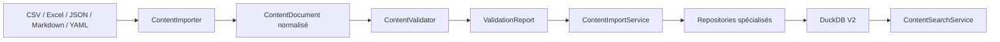

# Content Management Foundation

Statut : implémenté par LCAI-0005

## Architecture

La plateforme de contenu est indépendante du Learning Engine et de Streamlit :



- `domain/content` contient le vocabulaire immuable, les ports et les validations sans dépendance technique.
- `services/content` contient les quatre cas d'usage autorisés : import, validation, versionnement et recherche.
- `infrastructure/repositories/content.py` adapte les ports à DuckDB V2.
- l'application actuelle ne dépend d'aucun de ces modules et reste connectée à V1.

## Modèle

Le modèle expose `Program`, `Subject`, `Domain`, `Skill`, `SubSkill`, `Objective`, `Exercise`, `Question`, `Answer`, `Explanation`, `Hint`, `Media`, `Tag`, `Prerequisite`, `Version`, `ValidationStatus`, `Difficulty` et `CompetencyMapping`.

Les statuts sont `draft`, `review`, `approved` et `archived`. L'archivage remplace la suppression. Chaque snapshot possède numéro, auteur et dates; chaque transition produit un événement d'audit append-only.

## Import

Tous les adaptateurs implémentent `ContentImporter.load()` et produisent un `ContentDocument`; la persistance ne connaît donc aucun format source.

| Format | Adaptateur | Convention |
|---|---|---|
| JSON | `JSONContentImporter` | objet normalisé |
| CSV | `CSVContentImporter` | colonne `entity_type` |
| Excel | `ExcelContentImporter` | une feuille par collection |
| Markdown | `MarkdownContentImporter` | manifeste dans un bloc clôturé `json` |
| YAML | `YAMLContentImporter` | objet équivalent au JSON |

Le registre permet d'ajouter un format sans modifier les services. Excel et YAML signalent explicitement l'absence éventuelle de `openpyxl` ou `PyYAML`. L'import DuckDB est transactionnel et reste en `draft`; il ne migre aucune donnée V1.

## Validation et qualité

Le rapport contient code stable, sévérité, message et entité. Le pipeline contrôle :

- identifiants uniques;
- matières, domaines, compétences et prérequis référencés;
- difficulté fermée de 1 à 5;
- présence de réponse, énoncé et explication;
- exercices sans question, questions orphelines et compétences inutilisées;
- énoncés dupliqués;
- URI média vides;
- versions ou dates incohérentes;
- tags déclarés mais inutilisés.

`validation_runs` et `validation_issues` préparent les futurs outils d'administration.

## Versionnement

`content_versions` conserve les snapshots JSON. L'unicité `(entity_type, entity_id, version_number)` empêche l'écrasement. `content_status_events` conserve la chronologie et permet de reconstruire l'état courant.

```text
Draft -> Review -> Approved -> Archived
   |        |          |
   +--------+----------+-> Archived
            +-> Draft
```

## Repositories

`ProgramRepository`, `SubjectRepository`, `SkillRepository`, `ExerciseRepository`, `QuestionRepository`, `MediaRepository`, `VersionRepository`, `ValidationRepository`, `ContentSearchRepository` et `ContentUnitOfWork` forment la frontière transactionnelle. Ils exposent des upserts par code/version, jamais de suppression.

## Services

- `ContentImportService` sélectionne l'adaptateur et persiste le document.
- `ContentValidationService` produit et peut journaliser le rapport.
- `ContentVersionService` applique la machine d'états et expose l'historique.
- `ContentSearchService` recherche par matière, compétence, niveau, mot-clé, tags et difficulté.

## Limites

- aucun stockage physique ni contrôle réseau des médias;
- détection de doublons limitée aux énoncés identiques normalisés;
- associations polymorphes validées dans les repositories, faute de FK vers plusieurs tables;
- aucun outil d'administration ou branchement UI;
- aucune sélection adaptative, règle pédagogique ou maîtrise dans cette couche.

