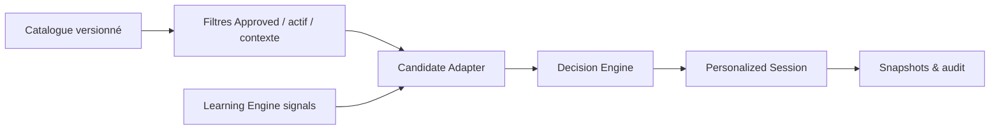

# Content Recommendation Integration

Le pipeline filtre dans l'ordre statut approuvé, activité, matière, compétence, difficulté, durée, objectif et niveau. Draft, Review et Archived sont exclus. Un contenu du niveau cible exige un marqueur explicite : `transition_ready`, `introductory`, `prerequisite_bridge` ou `next_grade_preparation`. La remédiation inter-niveaux exige également un tag ou marqueur explicite.

Le candidat conserve contenu/version, identifiant stable SHA-256, type, titre, matière, domaine, compétence, sous-compétence, programme, niveau, difficulté, durée, prérequis, tags et compatibilités. La maîtrise, confiance, tendance et récence proviennent directement des modèles LCAI-0006; aucune formule n'est dupliquée.

`PersonalizedSessionService` orchestre candidat → Decision Engine → séance. Il ne décide aucune priorité. Le budget quotidien est respecté et les raisons structurées du moteur sont conservées. En absence de contenu, aucun exercice n'est généré; un code tel que `NO_APPROVED_CONTENT`, `NO_CONTENT_FOR_GRADE`, `NO_CONTENT_FOR_SUBJECT`, `NO_CONTENT_FOR_SKILL`, `NO_CONTENT_FOR_OBJECTIVE` ou `NO_CONTENT_WITHIN_DURATION` est retourné.

Les snapshots, exclusions et propositions utilisent des identifiants stables et contraintes uniques. Un rerun identique ne crée ni second profil, Journey, candidat, décision ou séance.

Depuis LCAI-0009, `DuckDBRecommendationRepository.load_approved_contents()` lit la vue
`approved_learning_catalog`. Cette vue impose version courante Approved, approbation
active, exercice actif, rattachement au chapitre et compétence primaire. Le catalogue
livré contient des durées, difficultés, prérequis, tags de remédiation, marqueurs de
transition et compatibilités brevet directement transmissibles au Candidate Adapter.
