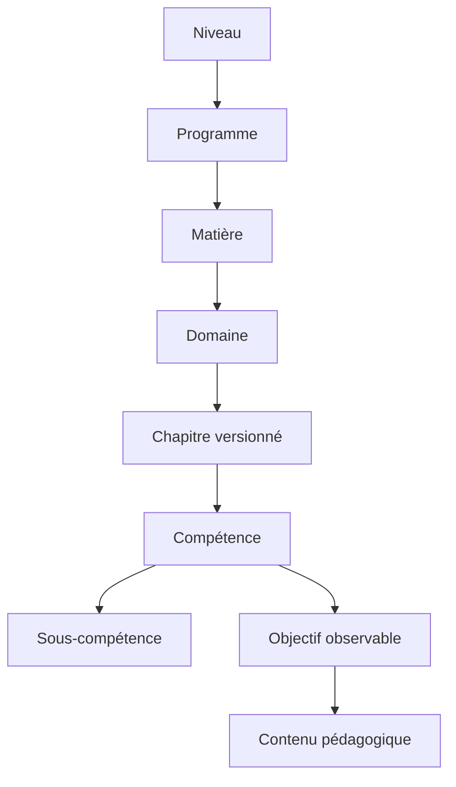

# Modèle curriculaire V2

LCAI-0009 ajoute une couche curriculaire additive au référentiel V2 existant. Le lot livré cible la 4e, la transition 4e vers 3e, la 3e et le brevet. Il ne constitue pas une transcription exhaustive des programmes officiels.

Les entités historiques `school_levels`, `programs`, `subjects`, `domains`, `skills` et `subskills` sont conservées. Les tables `curriculum_chapters`, `curriculum_skill_details`, `learning_objectives` et leurs liaisons complètent leur sémantique.

Le graphe `curriculum_skill_relations` distingue `required`, `recommended`, `remediation`, `transition` et `exam_dependency`. Chaque arc porte une force, un seuil de maîtrise, une justification, une source et un rôle de progression. Le service rejette auto-références et cycles avant écriture.

Le référentiel `exam_references` est versionné. Le lot `DNB-DEMO-2027` identifie seulement les compétences ciblées par ce catalogue ; il ne code aucun coefficient officiel et ne prédit aucune note.

