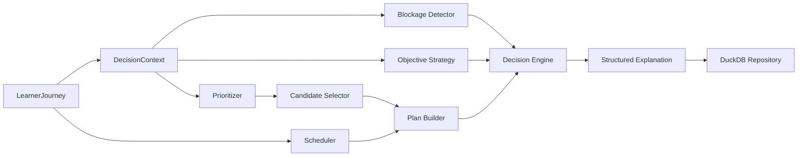

# Learner Journey & Intelligent Decision Engine

Statut : implémenté par LCAI-0007, non connecté à l'interface.

## Architecture

Le Scheduler détermine les fenêtres temporelles. Le Selector filtre les activités éligibles. Le Decision Engine arbitre quoi, pourquoi, quand, dans quel ordre, avec quelle difficulté et pour quelle durée. Aucun composant n'utilise de LLM.

## Learner Journey

`LearnerJourney` représente le projet complet de l'élève : apprenant, niveaux courant et cible, année scolaire, objectifs courant/long terme/examen, phase, échéance, matières préférées ou fragiles, durée quotidienne, disponibilités hebdomadaires, difficulté préférée, modes parent/élève, rythme, jours de révision, vacances et préparation de transition.

Le Journey et ses objectifs sont modifiables. La sauvegarde est transactionnelle et ne réinitialise pas la maîtrise LCAI-0006.

## Objectifs et stratégies

| Objectif | Stratégie par défaut |
|---|---|
| Revision | Spaced Revision |
| Catch Up | Catch-up |
| Consolidation | Foundation Reinforcement |
| Preparation Next Grade | Transition Preparation |
| Preparation Brevet/Bac/Exam | Exam Preparation |
| Homework | Intensive Revision |
| Long Term Mastery | Balanced Learning |

Les correspondances et pondérations résident dans `DecisionConfiguration`.

## Priorités

Ordre de sûreté :

1. P1 — prérequis bloquant, base 100;
2. P2 — compétence fragile, base 75;
3. P3 — révision périodique, base 60;
4. P4 — nouvelle compétence, base 40.

Des bonus déterministes s'ajoutent pour matière préférée, matière fragile, variété et proximité de l'échéance. Le tri final utilise bande, score puis identifiant stable, ce qui garantit un résultat reproductible.

## Détection des blocages

Le graphe de prérequis est parcouru récursivement avec protection contre les cycles. Un prérequis absent ou sous le seuil 0,45 est bloquant. Le résultat fournit compétence cible, prérequis directs, chaîne complète, sévérité et raison. Le message structuré est : « Impossible de poursuivre tant que le prérequis n'est pas consolidé. »

## Planification

Le Scheduler choisit la prochaine disponibilité compatible avec l'horloge injectée. Sans calendrier, la décision peut commencer maintenant. Le budget quotidien limite le plan; chaque activité dure entre 10 et 45 minutes par défaut. En mode vacances, le budget est réduit à 65 %, sans supprimer complètement l'accompagnement.

La difficulté combine la difficulté candidate et la préférence du Journey, reste entre 1 et 5 et ne modifie aucune maîtrise.

## Décision explicable

`LearningDecision` contient : stratégie, objectif, activité sélectionnée, plan ordonné, scores de priorité, blocages, confiance, hash du contexte, corrélation, versions moteur/règles et explication structurée : raison, pourquoi maintenant, difficulté, matière, durée et règles déclenchées.

À contexte et horloge identiques, le hash, l'ordre et la décision sont identiques. Les snapshots SHA-256 permettent l'audit. Les décisions sont immuables; une modification du Journey crée une nouvelle décision.

## Objets pour dashboards futurs

Les objets suivants sont prêts sans ajout d'UI : `TodayPlan`, `WeeklyPlan`, `CriticalSkills`, `UpcomingExam`, `JourneyProgress` et `ReadinessTimeline`.

## Persistance

La migration 008 ajoute : préférences du Journey, objectifs pédagogiques, éléments du plan et snapshot complet du résultat. La table centrale `learning_decisions` existante est réutilisée. `decision_plan_items` conserve l'ordre, l'horaire, la durée et la difficulté.

## Limites

- pas de calendrier graphique ni modification de Streamlit;
- pas de calcul automatique des vacances scolaires nationales;
- pas de sélection sémantique d'exercice : les candidats doivent être fournis par un futur adaptateur de catalogue;
- pas d'optimisation stochastique ou de LLM;
- pas encore de détection de famine à très long terme au-delà du bonus de variété;
- les refus ou reports utilisateur seront intégrés dans un ticket ultérieur.
