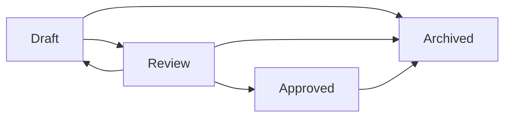

# Workflow éditorial

Les rôles métier sont `ContentAuthor`, `ContentReviewer`, `ContentApprover` et `ContentAdministrator`. Lorsque la séparation des rôles est active, l’auteur ne peut être reviewer ou approver.

Une approbation nécessite :

- une validation sans erreur bloquante ;
- un rattachement curriculaire complet ;
- une difficulté et une durée valides ;
- une réponse et un corrigé pour tout contenu évaluatif ;
- une revue humaine ;
- un score qualité explicable ;
- un événement d’approbation persistant.

Le score de 0 à 100 expose critères réussis, critères manquants, blocages et avertissements. Il n’effectue jamais l’approbation.

Une version Approved n’est pas modifiée en place. Toute évolution doit créer une nouvelle version Draft ; l’ancienne version reste reproductible.

