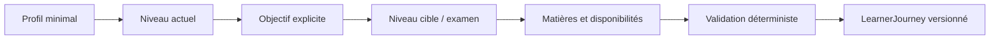

# Learner Onboarding V2

L'onboarding V2 est indépendant de Streamlit et produit un `LearnerJourney` LCAI-0007 valide.

Étapes : identité fonctionnelle minimale, niveau référencé, objectif, cible, examen, date, matières, disponibilités, préférences utiles et confirmation. La date de naissance est facultative. Aucune typologie pseudo-scientifique n'est utilisée.

La matrice niveau/objectif est dans `OnboardingConfiguration`. Elle distingue autorisé, recommandé, anticipation et incompatible. `Preparation Next Grade` exige la cible suivante; brevet accepte la 4e avec avertissement; bac accepte la seconde en anticipation et première/terminale normalement. Une date passée, une matière inconnue ou une transition incohérente sont bloquantes.

Chaque problème expose code, sévérité, champ, message, règle et suggestion. Le mapping vers Journey conserve objectifs, niveau, matières prioritaires et fragiles, horaires, rythme, difficulté et vacances. Chaque modification crée une ligne dans `learner_journey_versions`; les maîtrises et tentatives ne sont jamais touchées.

Interface : `v2_app.py`, uniquement avec `LCAI_ENABLE_V2_UI=true`. L'entrée V1 `app.py` reste inchangée et par défaut.

