# Learning Engine longitudinal

Statut : fondation déterministe LCAI-0006, non connectée à l'interface.

## Architecture et responsabilités

Le domaine `domain/learning` ne dépend ni de Streamlit, DuckDB, un LLM, une matière, une classe ou un examen. Les calculateurs sont purs. `services/learning` expose des cas d'usage minces et l'orchestrateur transactionnel. `infrastructure/repositories/learning.py` est le seul adaptateur DuckDB.

```mermaid
flowchart LR
    A["Learner Attempt"] --> E["Attempt Evaluation"]
    E --> F["Forgetting Adjustment"]
    F --> M["Mastery Update"]
    M --> D["Difficulty Recommendation"]
    D --> P["Progress Update"]
    P --> T["Transition Readiness"]
    T --> X["Exam Readiness"]
    X --> V["Domain Events"]
    V --> R["Persistence"]
```



Le moteur évalue et produit des projections. Il ne choisit jamais d'exercice : ce choix appartient au futur Decision Engine. Il ne produit aucune explication conversationnelle.

## Vision longitudinale collège–lycée

`LearnerJourneyContext` sépare niveau actuel, niveau cible, année scolaire, programme, phase et examen. `MasteryState` est indexé par apprenant et compétence, jamais par année : un passage 4e → 3e → seconde → première → terminale conserve donc score, observations, fragilités, récence, confiance, stabilité et niveau d'origine.

Les niveaux seedés couvrent quatrième, troisième, seconde, première et terminale. `GradeLevel(code, rank, label)` reste extensible. Les phases sont Diagnostic, Remediation, PreYearPreparation, CurrentLearning, Consolidation, Practice, SpacedRevision, AssessmentPreparation, ExamPreparation et TransitionPreparation.

## Évaluation d'une tentative

La preuve normalisée est :

```text
score = qualité × difficulté × indices × essais × temps × phase × révision
```

- qualité : exactitude partielle 0–1;
- difficulté : multiplicateur 0,85 à 1,15;
- chaque indice et essai supplémentaire réduit la preuve avec un plancher;
- temps inférieur à 18 % du temps attendu est modérément pénalisé comme potentiellement aléatoire;
- temps supérieur au double est progressivement pénalisé;
- solution révélée : score plafonné à 0,25;
- abandon : score plafonné à 0,10;
- diagnostic, remédiation, révision, examen et transition utilisent des multiplicateurs configurables.

Une réponse correcte, difficulté 3, 60 s attendues/réelles, sans indice donne une preuve de 1,0. Avec deux indices, elle donne 0,8. Une solution révélée ne dépasse jamais 0,25.

## Maîtrise, seuils, confiance et tendance

La mise à jour part du score après oubli et s'approche du signal avec un taux amorti : 0,28 pour une preuve positive, 0,14 pour une preuve négative, modulé par la confiance. Une observation ne peut donc normalement ni établir une maîtrise totale ni détruire brutalement un acquis.

Seuils par défaut : NotStarted `<0,20`, Emerging `<0,45`, Developing `<0,70`, Proficient `<0,88`, Mastered au-delà. La confiance croît avec les observations. La stabilité croît surtout avec les réussites. La tendance est improving, stable ou declining selon le delta observé.

## Oubli

Le modèle exponentiel opérationnel applique un taux quotidien à la durée écoulée, réduit par stabilité, nombre d'observations et difficulté historique. La résilience est plafonnée afin de conserver une dégradation faible mais réelle. Le plancher par défaut est 0,35. Le calcul retourne score observé, score ajusté, dégradation, prochaine date probable de révision, confiance et facteurs. Il est désactivable.

## Difficulté adaptative

La difficulté reste entre 1 et 5 et évolue au plus d'un niveau. Trois réussites stables, une maîtrise suffisante et une confiance ≥0,55 autorisent une montée. Deux échecs consécutifs ou un prérequis fragile provoquent une baisse. Une maîtrise ancienne reçoit au plus une difficulté 3 de vérification. Les facteurs positifs, négatifs, alertes et règle déclenchée sont retournés.

## Progression et couverture

Le même agrégateur pondéré calcule sous-compétence, compétence, domaine, matière, programme, niveau et examen. Par défaut : 70 % maîtrise observée et 30 % couverture. Les compétences non évaluées restent explicitement comptées; les acquis anciens contribuent toujours.

## Préparation au niveau suivant

`TransitionReadiness` combine progression des compétences requises, couverture, confiance et pénalité des prérequis bloquants. Il expose acquis, fragiles et bloquants. Il représente aussi bien l'entrée en 3e que le passage 3e → seconde ou les transitions ultérieures.

## Préparation aux examens

`ExamReadiness` est générique : Brevet, Baccalauréat ou code futur. Il retourne score global, scores par matière, couverture, maîtrisées, fragiles, non évaluées, confiance, tendance et raisons. Il ne prédit jamais de note officielle.

## Prérequis

Chaque prérequis est acquis, fragile, non acquis ou non évalué. Son `origin_grade_code` permet de détecter en seconde une lacune née en 3e ou plus tôt. La remédiation et le choix du prochain contenu sont différés.

## Événements et idempotence

Événements : AttemptEvaluated, MasteryUpdated, MasteryLevelChanged, DifficultyRecommendationChanged, PrerequisiteGapDetected, LearningRegressionDetected, MasteryAchieved, RevisionDueDetected, TransitionReadinessChanged, ExamReadinessChanged et CurriculumCoverageChanged.

`stable_id` est unique dans `learning_attempt_inputs`. La transaction écrit tentative, projection, historique, événements et états de préparation ensemble. Un second traitement dans la même instance retourne le résultat marqué `already_processed`; une autre instance détecte la clé persistée et refuse le retraitement. Les contraintes uniques empêchent tout double événement ou historique.

## Configuration et observabilité

`LearningEngineConfiguration` centralise seuils, poids, pénalités, taux d'évolution, oubli, plancher, règles de difficulté, confiance, transition, examen et multiplicateurs par phase. Sa validation rejette les seuils incohérents.

Les logs structurés contiennent seulement identifiant stable, nombre d'événements et durée. Réponses libres, identité sensible, prompts et chaînes de connexion ne sont jamais journalisés. `LearningEngineMetrics` retourne durée, événements, mises à jour, calculs et erreurs.

## Limites

- modèle initial volontairement transparent, non validé comme modèle cognitif scientifique;
- pas de scheduler, de sélection de contenu, de prédiction de note ou de LLM;
- pas encore de calibration empirique des coefficients;
- les programmes lycée et leurs compétences devront être importés via la plateforme de contenu;
- la projection courante est persistée; les recalculs historiques complets et la gestion concurrente multi-processus restent à renforcer.
